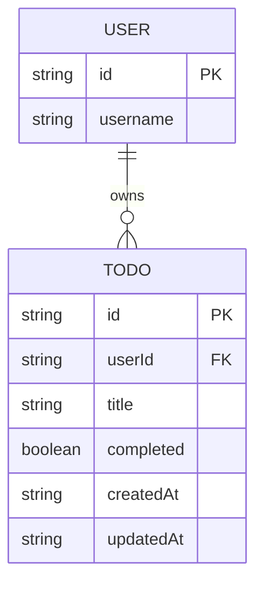

# Domain Model

The domain is a single entity: a Todo, owned by exactly one User (identified by their Thunder subject id).

`USER` is not stored by this system — it is the signed-in identity from Thunder, referenced by `TODO.userId`. `TODO` is owned by exactly one user and is never visible to any other user.